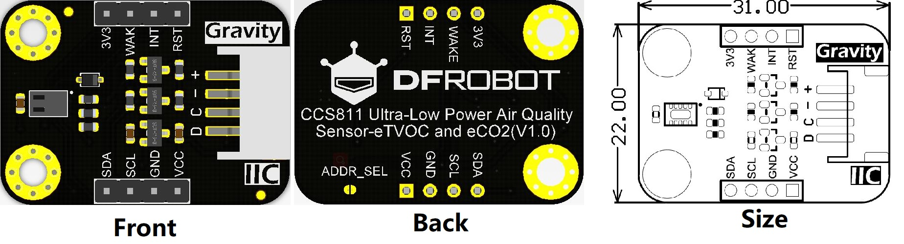

# DFRobot_CCS811
This sensor is used to measure the concentration of carbon dioxide and TVOC(TotalVolatileOrganicCompounds) via IIC within measurement range 400-8000ppm(parts per million) for the former and 0-1100ppb(parts per billion) for the latter. It features small size, low power consumption, high accuracy and short pre-heat time. Besides, this sensor provides grade 1 MSL(moisture sensitivity level), which makes the sensor suitable for all kinds of moist operating conditions. Meanwhile, users can input environment parameter to calibrate the output data. <br>

Carbon dioxide concentration(ppm)  | Impact on human-beings
------------------ | ---------
more than 5000        |      toxic 
2500-5000        |      unhealthy to human body
1000-2500        |      feel sleepy 
500-1000        |      turbid air
less than 500        |      no effect

TVOC concentration (ppb)     | Impact on human-beings
------------------ | ---------
less than 50        |      no effect 
50-750        |      uncomfortable, nervous 
760-6000        |      uncomfortable, nervous, headache
more than 6000       |      headache, neurological problems 

<br>

<br>

* Arduino UNO
<br>

<br>

   
## Table of Contents
* [URL](#url)
* [Summary](#summary)
* [Installation](#installation)
* [Methods](#methods)
* [Compatibility](#compatibility)
* [History](#history)
* [Credits](#credits)

## URL
* Project URL : ```https://github.com/DFRobot/DFRobot_CCS811```

* Tutorial URL : [Wiki](https://wiki.dfrobot.com/Gravity:%20CCS811%20Air%20Quality%20Sensor%20SKU:%20SEN0318).

* Get a purchase connection: [store](https://www.dfrobot.com/).

## Summary

1. Read carbon dioxide concentration (Unit:ppm) <br>
2. Read TVOC concentration (Unit:ppb) <br>
3. Change the sampling interval of data reading to change power consumption <br>
4. Set environment parameter to calibrate the readings <br>
5. Supports for interrupt measurement <br>

## Installation

To use this library, first download the library file, paste it into the \Arduino\libraries directory, then open the examples folder and run the demo in the folder.

## Methods

```C++

  /**
   * @brief Init function
   * @return Return 0 if initialization succeeds, otherwise return non-zero. 
   */
  int begin(void);
  
  /**
   * @brief Judge if the data can be read 
   * @return true when the reading is successful, false means it fails to read.
   */
  bool checkDataReady();

  /**
   * @brief Software reset, clear all configured register parameters 
   */
  void softReset();
  
    /**
   * @brief Set environment parameter 
   * @param temperature Input temperature value, unit: centigrade, range (-40~85℃)
   * @param humidity    Input humidity value, unit: RH, range (0~100)
   */
  void setInTemHum(float temperature, float humidity);
  
  /**
   * @brief Measurement parameter configuration 
   * @param mode:in typedef enum{
   *              eClosed,      //Idle (Measurements are disabled in this mode)
   *              eCycle_1s,    //Constant power mode, IAQ measurement every second
   *              eCycle_10s,   //Pulse heating mode IAQ measurement every 10 seconds
   *              eCycle_60s,   //Low power pulse heating mode IAQ measurement every 60 seconds
   *              eCycle_250ms  //Constant power mode, sensor measurement every 250ms 1xx: Reserved modes (For future use)
   *          }eCycle_t;
   * @param thresh:0 for Interrupt mode operates normally; 1 for interrupt mode only asserts the nINT signal (driven low) if the new
   * @param interrupt:0 for Interrupt generation is disabled; 1 for the nINT signal is asserted (driven low) when a new sample is ready in
   */
  setMeasurementMode(eCycle_t mode, uint8_t thresh = 0, uint8_t interrupt = 0),
  
  /**
   * @brief Get current parameter configuration 
   * @return parameter configuration code, needs to be converted into binary code to analyze
   *         The 2nd:    0 Interrupt mode (if enabled) operates normally,
   *                   1 Interrupt mode (if enabled) only asserts the nINT signal (driven low) if the new
   *         The 3rd:    0 Interrupt generation is disabled
   *                   1 The nINT signal is asserted (driven low) when a new sample is ready in
   *         The 4th: 6th:000 Idle (Measurements are disabled in this mode)
   *                 001 Constant power mode, IAQ measurement every second
   *                 010 Pulse heating mode IAQ measurement every 10 seconds
   *                 011 Low power pulse heating mode IAQ measurement every 60 seconds
   *                 100 Constant power mode, sensor measurement every 250ms 
   */
  uint8_t getMeasurementMode();
  
  /**
   * @brief Get the current carbon dioxide concentration 
   * @return current carbon dioxide concentration, unit:ppm
   */
  uint16_t  getCO2PPM();

  /**
   * @brief Get current TVOC concentration
   * @return Return current TVOC concentration, unit: ppb
   */
  uint16_t getTVOCPPB();
  
  /**
   *@brief get the current baseline number
   *@return a Hexadecimal number of the current baseline number
   */
  uint16_t readBaseLine();
  
  /**
   *@brief write a baseline number into register
   *@param a Hexadecimal number get from getBaseLine.ino
   */
  void writeBaseLine(uint16_t baseLine);
```

## Compatibility

MCU                | Work Well    | Work Wrong   | Untested    | Remarks
------------------ | :----------: | :----------: | :---------: | -----
Arduino uno        |      √       |              |             | 
Mega2560        |      √       |              |             | 
Leonardo        |      √       |              |             | 
ESP32        |      √       |              |             | 
micro:bit        |      √       |              |             | 


## History

- Data 2019-7-19
- Version V0.1


## Credits

Written by(yufeng.luo@dfrobot.com), 2019. (Welcome to our [website](https://www.dfrobot.com/))


