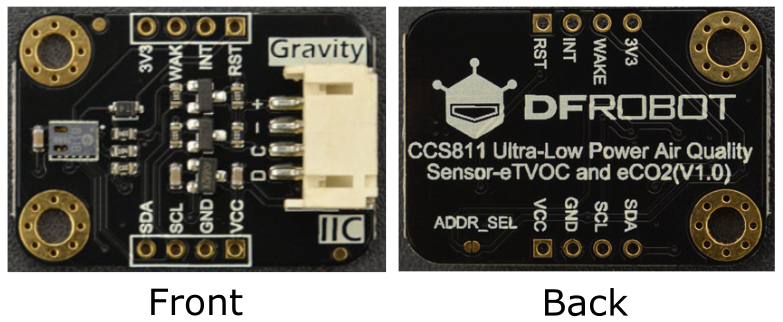
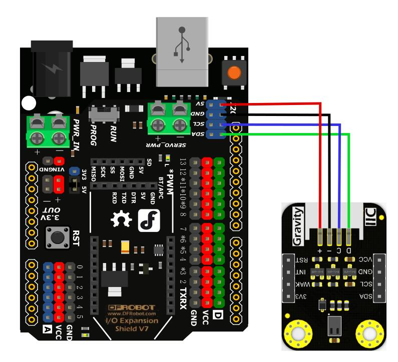

# DFRobot_CCS811

- [中文版](./README_CN.md)

This sensor is used to measure the concentration of carbon dioxide and TVOC(TotalVolatileOrganicCompounds) via IIC within measurement range 400-8000ppm(parts per million) for the former and 0-1100ppb(parts per billion) for the latter. It features small size, low power consumption, high accuracy and short pre-heat time. Besides, this sensor provides grade 1 MSL(moisture sensitivity level), which makes the sensor suitable for all kinds of moist operating conditions. Meanwhile, users can input environment parameter to calibrate the output data. <br>

Carbon dioxide concentration(ppm)  | Impact on human-beings
------------------ | ---------
more than 5000        |      toxic 
2500-5000        |      unhealthy to human body
1000-2500        |      feel sleepy 
500-1000        |      turbid air
less than 500        |      no effect

TVOC concentration (ppb)     | Impact on human-beings
------------------ | ---------
less than 50        |      no effect 
50-750        |      uncomfortable, nervous 
760-6000        |      uncomfortable, nervous, headache
more than 6000       |      headache, neurological problems 

<br>

<br>

* Arduino UNO
<br>

<br>

## Product Link（https://www.dfrobot.com/product-1981.html）
    SKU：SEN0318


## Table of Contents
* [Summary](#summary)
* [Installation](#installation)
* [Methods](#methods)
* [Compatibility](#compatibility)
* [History](#history)
* [Credits](#credits)


## Summary

1. Read carbon dioxide concentration (Unit:ppm) <br>
2. Read TVOC concentration (Unit:ppb) <br>
3. Change the sampling interval of data reading to change power consumption <br>
4. Set environment parameter to calibrate the readings <br>
5. Supports for interrupt measurement <br>

## Installation
There are two ways to use the library:
1. Open the Arduino IDE, search for "DFRobot_BMX160" in Tools --> Manager Libraries on the status bar, and install the library.
2. First download the library file, paste it into the \Arduino\libraries directory, then open the examples folder and run the demo in that folder.

## Methods

```C++
    /**
     * @fn begin
     * @brief initialization function
     * @return initialization status
     * @retval ERR_OK          initialization success
     * @retval ERR_DATA_BUS    error in data bus
     * @retval ERR_IC_VERSION  chip version mismatch
     */ 
    int begin();

    /**
     * @fn checkDataReady
     * @brief Judge if there is data to read 
     * @return  the result of checking
     * @retval  true   there is
     * @retval  false  there is no
     */
    bool checkDataReady();

    /**
     * @fn softReset
     * @brief Reset sensor, clear all configured data.
     */
    void softReset();

    /**
     * @fn setInTempHum
     * @brief Set environment parameter 
     * @param temperature Set temperature value, unit: centigrade, range (-40~85℃)
     * @param humidity    Set humidity value, unit: RH, range (0~100)
     */
    void setInTempHum(float temperature, float humidity);

    /**
     * @fn setMeasurementMode
     * @brief Measurement parameter configuration 
     * @param mode:Measurements mode
     * @n            eClosed       Idle (Measurements are disabled in this mode)
     * @n            eCycle_1s     Constant power mode, IAQ measurement every second
     * @n            eCycle_10s    Pulse heating mode IAQ measurement every 10 seconds
     * @n            eCycle_60s    Low power pulse heating mode IAQ measurement every 60 seconds
     * @n            eCycle_250ms  Constant power mode, sensor measurement every 250ms 1xx: Reserved modes (For future use)
     * @param thresh
     * @n            0             for Interrupt mode operates normally
     * @n            1             for interrupt mode only asserts the nINT signal (driven low) if the new
     * @param interrupt
     * @n            0             for Interrupt generation is disabled
     * @n            1             for the nINT signal is asserted (driven low) when a new sample is ready in
     */
    void setMeasurementMode(eCycle_t mode, uint8_t thresh = 0, uint8_t interrupt = 0);

    /**
     * @fn setThresholds
     * @brief Set interrupt thresholds 
     * @param lowToMed: interrupt triggered value in range low to middle 
     * @param medToHigh: interrupt triggered value in range middle to high 
     */
    void setThresholds(uint16_t lowToMed, uint16_t medToHigh);

    /**
     * @fn getMeasurementMode
     * @brief Get current configured parameter
     * @return configuration code, needs to be converted into binary code to analyze
     * @n       The 2nd: Interrupt mode (if enabled) operates normally,1: Interrupt mode (if enabled) only asserts the nINT signal (driven low) if the new
     * @n       The 3rd: Interrupt generation is disabled,1: The nINT signal is asserted (driven low) when a new sample is ready in
     * @n       The 4th: 6th: in typedef enum eCycle_t
     */
    uint8_t getMeasurementMode();

    /**
     * @fn getCO2PPM
     * @brief Get the current carbon dioxide concentration
     * @return current carbon dioxide concentration, unit:ppm
     */
    uint16_t getCO2PPM();

    /**
     * @fn getTVOCPPB
     * @brief Get current TVOC concentration
     * @return Return current TVOC concentration, unit: ppb
     */
    uint16_t getTVOCPPB();

    /**
     * @fn readBaseLine
     * @brief get the current baseline number
     * @return a Hexadecimal number of the current baseline number
     */
    uint16_t readBaseLine();

    /**
     * @fn writeBaseLine
     * @brief write a baseline number into register
     * @param baseLine Hexadecimal number get from baseLine()
     */
    void writeBaseLine(uint16_t baseLine);
```

## Compatibility

MCU                | Work Well    | Work Wrong   | Untested    | Remarks
------------------ | :----------: | :----------: | :---------: | -----
Arduino uno        |      √       |              |             | 
Mega2560        |      √       |              |             | 
Leonardo        |      √       |              |             | 
ESP32        |      √       |              |             | 
micro:bit        |      √       |              |             | 


## History

- 2021/10/22 - Version 1.0.1 released.
- 2019/07/19 - Version 1.0.0 released.

## Credits

Written by(feng.yang@dfrobot.com), 2021. (Welcome to our [website](https://www.dfrobot.com/))


